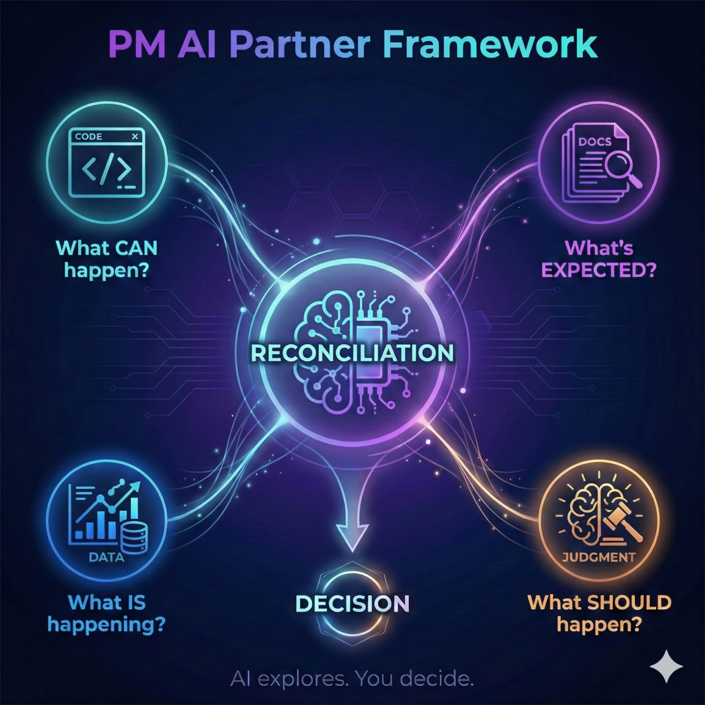
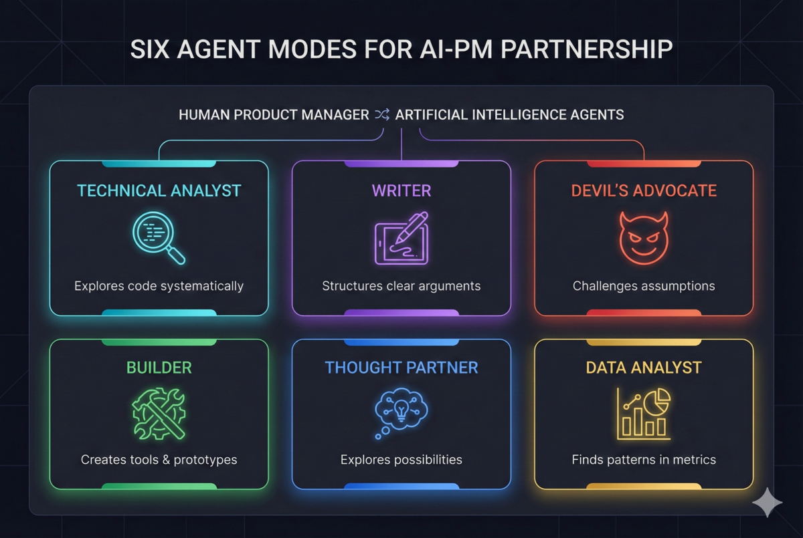

# PM AI Partner Framework

**A ready-to-use template for Product Managers who want to work smarter with AI.**

Fork this repo → Customize → Start using AI as your thinking partner.

[](https://github.com/ahmedkhaledmohamed/PM-AI-Partner-Framework)



> **Finding this useful?** ⭐ [Star this repo](https://github.com/ahmedkhaledmohamed/PM-AI-Partner-Framework) — it helps others discover it and lets me know it's working!
>
> **Questions or feedback?** [Quick survey](https://docs.google.com/forms/d/e/1FAIpQLScOSVX0EGYYZpnanXxpwofhcng4BqY7ddFBKaqQhB1PvCkShA/viewform) (2 min) · [Start a discussion](https://github.com/ahmedkhaledmohamed/PM-AI-Partner-Framework/discussions) · [Share your experience](https://github.com/ahmedkhaledmohamed/PM-AI-Partner-Framework/issues/new?template=success_story.md)

---

## Demo Video

<!-- TODO: Add YouTube embed after recording -->
*Coming soon: A 10-minute walkthrough showing the framework in action.*

---

## Quick Start (3 Steps)

### 1. Fork This Repo
Click "Fork" on GHE (or clone directly).

### 2. Customize Your Context
Edit `CLAUDE.md` with your team/domain info:
```markdown
# My Workspace
**My Role**: Product Manager
**Domain**: [Your area]
**Focus**: [Current priorities]
```

### 3. Start Working
Open in Cursor → Use AI as your thinking partner:
- Draft ideas in `sandbox/`
- Polish and share from `product-catalog/`

---

## What's Included

```
pm-ai-partner-framework/
├── CLAUDE.md                 # Main AI context (customize this!)
├── sandbox/                  # Your personal drafts & exploration
│   ├── CLAUDE.md            # Pre-configured for rough work
│   └── _examples/           # Example files to learn from
├── product-catalog/          # Polished work ready to share
│   ├── CLAUDE.md            # Pre-configured for quality output
│   └── _examples/           # Example polished docs
├── framework/                # Framework documentation
│   ├── core/                # Agent modes, workflows, philosophy
│   │   ├── pm-ai-partner-framework.md   # Full guide
│   │   ├── quick-reference.md           # Cheat sheet
│   │   ├── starter-prompts.md           # Copy-paste prompts
│   │   └── workflows/                   # Repeatable patterns
│   ├── templates/           # Config templates (CLAUDE.md, mcp.json)
│   ├── demo/                # Demo scripts & materials
│   └── examples/            # Case studies
├── getting-started.md        # Detailed setup guide
└── site/                     # Visual landing page
```

---

## The Core Idea

> **PM work is reconciling four sources of truth. AI helps you explore each faster. Judgment stays human.**

```
┌─────────────┐  ┌─────────────┐  ┌─────────────┐  ┌─────────────┐
│    CODE     │  │    DOCS     │  │    DATA     │  │  JUDGMENT   │
│  Technical  │  │ Contextual  │  │  Empirical  │  │    Human    │
│             │  │             │  │             │  │             │
│ What CAN    │  │ What's      │  │ What IS     │  │ What        │
│ happen?     │  │ expected?   │  │ happening?  │  │ SHOULD?     │
└──────┬──────┘  └──────┬──────┘  └──────┬──────┘  └──────┬──────┘
       │                │                │                │
       └────────────────┴────────┬───────┴────────────────┘
                                 ▼
                    ┌─────────────────────┐
                    │    RECONCILIATION   │
                    │     (AI + Human)    │
                    └──────────┬──────────┘
                               ▼
                    ┌─────────────────────┐
                    │      DECISION       │
                    └─────────────────────┘
```

---

## Six Agent Modes

Tell AI which "hat" to wear for your task:



| Mode | When to Use | Try Saying |
|------|-------------|------------|
| **Thought Partner** | Brainstorming, exploring options | "Help me think through this problem..." |
| **Technical Analyst** | Understanding systems, code | "Explain how [X] works..." |
| **Writer** | Creating documents | "Help me write a [brief/strategy/email]..." |
| **Devil's Advocate** | Stress-testing ideas | "Challenge this proposal..." |
| **Builder** | Creating tools, scripts | "Build me a simple [X]..." |
| **Data Analyst** | Analyzing metrics | "What patterns do you see in this data?" |

---

## Nine Workflow Patterns

Repeatable processes for common PM tasks:

| # | Pattern | When to Use |
|---|---------|-------------|
| 1 | Strategic Clarity | New role, team needs definition |
| 2 | Planning Cycle | Quarterly/sprint planning |
| 3 | Codebase Discovery | Understanding what actually exists |
| 4 | Tool Building | Creating internal tools |
| 5 | Communication Prep | Presentations, dev talks |
| 6 | PM-Eng Bridge | Translating code ↔ product |
| 7 | Data Investigation | Metrics analysis |
| 8 | Doc Restructuring | Fixing confusing docs |
| 9 | Analysis Pipeline | Data question → shareable presentation |

---

## Cursor Skills (Slash Commands)

10 reusable AI behaviors you can invoke via `/command` or auto-trigger by context:

| Type | Skills |
|------|--------|
| Agent Modes (6) | `/thought-partner`, `/technical-analyst`, `/writer`, `/devil-advocate`, `/builder`, `/data-analyst` |
| Scenarios (3) | `/product-brief`, `/meeting-prep`, `/stakeholder-update` |
| Workflows (1) | `/strategic-clarity` |

Each skill includes instructions, examples, and lessons learned from real usage. Install from `framework/templates/skills/`.

---

## Key Resources

| Need | Go To |
|------|-------|
| **Get set up** | [`getting-started.md`](getting-started.md) |
| Full framework guide | [`framework/core/pm-ai-partner-framework.md`](framework/core/pm-ai-partner-framework.md) |
| One-page cheat sheet | [`framework/core/quick-reference.md`](framework/core/quick-reference.md) |
| Copy-paste prompts | [`framework/core/starter-prompts.md`](framework/core/starter-prompts.md) |
| Config templates | [`framework/templates/`](framework/templates/) |
| Cursor Skills | [`framework/templates/skills/`](framework/templates/skills/) |
| Presentations | [`site/presentations/`](site/presentations/) |
| Case studies | [`framework/examples/case-studies/`](framework/examples/case-studies/) |
| Workflow guides | [`framework/core/workflows/`](framework/core/workflows/) |
| Release notes | [`RELEASE-NOTES.md`](RELEASE-NOTES.md) |

---

## Customization Guide

### Essential (Do First)
1. Edit `CLAUDE.md` with your context
2. Review `sandbox/_examples/` and `product-catalog/_examples/`
3. Delete example files when you understand the pattern

### Optional (Power Users)
- Copy templates from `framework/templates/` as needed
- Set up MCP tools (see `getting-started.md`)
- Customize `.cursorrules` for your preferences

---

## Contributing

We welcome contributions! See [`CONTRIBUTING.md`](CONTRIBUTING.md) for ways to help:

- Share your success stories
- Report issues or suggest features
- Add examples and case studies
- Improve documentation

---

## Author & Contact

**Author:** Ahmed Khaled Mohamed  
**Email:** [ahmd.khaled.a.mohamed@gmail.com](mailto:ahmd.khaled.a.mohamed@gmail.com)  
**LinkedIn:** [Ahmed Khaled](https://linkedin.com/in/ahmedkhaledmohamed)

---

## Related

- **Framework Website:** [`site/index.html`](site/index.html)
- **Substack Article:** [PM AI Partner Framework](https://substack.com/home/post/p-184388693)

---

*Version 1.4.0 · February 2026*
