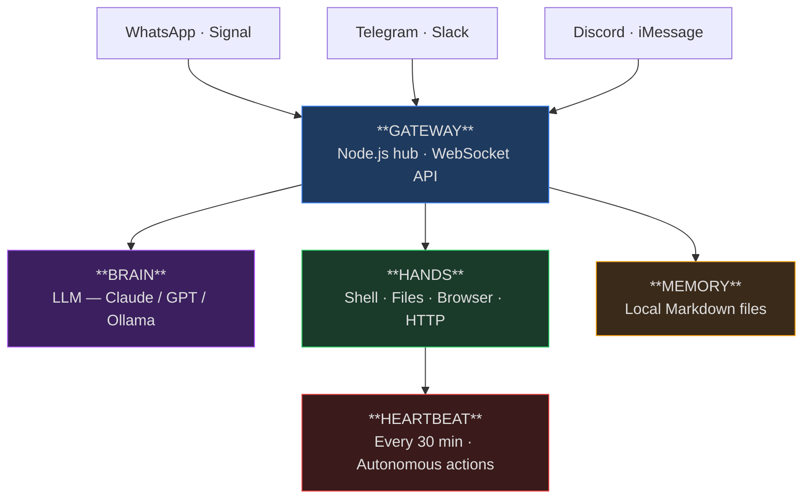

# I Spent 3 Hours Understanding the Fastest-Growing Open-Source Project in History. Here's What I Found, and How.

**OpenClaw** went from zero to 220,000 GitHub stars in 84 days — faster than React, Linux, or Python ever did. It was renamed three times in one week. Crypto scammers hijacked its old accounts within 10 seconds of a rebrand. Security researchers found 900 malicious plugins in its marketplace. And millions of people are running it on their personal machines right now.

I'm a Product Manager, not a developer. But I wanted to understand *how this thing actually works* — the architecture, the numbers, the risks, the product decisions that made it explode. So I used a structured framework I built for exactly this kind of exploration, and in about 3 hours I had a complete technical breakdown, a slide deck with charts, and a product analysis.

This article is two things at once: a deep dive into OpenClaw's architecture and growth, and a demonstration of how anyone — PM, designer, analyst, founder — can rapidly understand complex technical projects using AI as a structured thinking partner.

---

## What Is OpenClaw?

OpenClaw is a self-hosted AI assistant that runs on your computer and connects through the messaging apps you already use — WhatsApp, Telegram, Slack, Discord, Signal, iMessage. Unlike ChatGPT or Claude's web interface, OpenClaw doesn't just *answer questions*. It *does things*: books flights, manages your email, schedules meetings, runs terminal commands, browses the web, and even controls smart home devices.

The key difference: it runs locally. Your data never leaves your machine (unless you tell it to). There's no subscription, no cloud dependency, no company that can change the terms of service. You own the whole thing.

Created by Peter Steinberger — an Austrian developer known for founding PSPDFKit — OpenClaw launched in November 2025 and became the fastest-growing software repository in GitHub history.

---

## The Architecture: How It Actually Works

OpenClaw has four core components. Understanding them gives you the complete picture.

### The Gateway (The Nervous System)

A single Node.js process running on `127.0.0.1:18789` via WebSocket. This is the control plane — it manages:

- **Channel adapters** for every connected messaging platform simultaneously
- **Session management** and message routing
- **Security enforcement** and access control
- **Plugin loading** and configuration
- **Webhook and cron job** execution

Think of it as a switchboard operator that sits between every messaging app and the AI brain. One Gateway per machine, handling all conversations.

### The Brain (The Reasoning Engine)

The LLM layer — Anthropic Claude, OpenAI GPT, xAI Grok, or local models via Ollama. The Brain interprets requests, breaks them into steps, and decides what actions to take.

Critically, **the Brain never directly touches the filesystem or network**. It can only *request* actions from the Hands through a structured JSON tool-call protocol. This separation is an intentional security boundary.

### The Hands (The Execution Environment)

Four capabilities that execute the Brain's decisions:

| Capability | What It Does |
|-----------|-------------|
| **Shell** | Runs terminal commands |
| **Filesystem** | Reads and writes files |
| **Browser** | Chromium automation for web tasks |
| **HTTP** | Makes API requests |

The Hands run with *your* user permissions. Whatever you can do on your computer, OpenClaw can do. This is both the superpower and the risk.

### The Memory (The Persistence Layer)

Local Markdown files stored in `~/.openclaw/memory/` containing your preferences, contacts, project notes, and things the agent has learned. Memory survives restarts and is *never* sent to cloud services.

### The Heartbeat (The Autonomy Engine)

Every 30 minutes (configurable), the Gateway sends the agent a heartbeat prompt. The agent checks `HEARTBEAT.md` for scheduled tasks and takes autonomous action — no user input needed. This is what makes OpenClaw feel "alive": it can monitor your inbox, check prices, send reminders, and execute workflows while you're away.

---

## The Numbers: Growth That Breaks the Chart

### Star Growth: 0 to 220K in 84 Days

| Date | Stars | Event |
|------|-------|-------|
| Nov 24, 2025 | 0 | Repository created |
| Jan 24, 2026 | ~1,000 | 2 months of organic growth |
| Jan 26, 2026 | ~26,000 | **+25,310 in one day** (GitHub record) |
| Jan 27, 2026 | ~40,000 | Anthropic trademark request / Moltbot rebrand |
| Jan 30, 2026 | ~60,000 | Final rebrand to OpenClaw |
| Feb 8, 2026 | ~145,000 | Averaging 1,000+ stars/day |
| Feb 17, 2026 | 200,000 | 84-day milestone |
| Feb 23, 2026 | 220,651 | Current |

For context: React took over a *decade* to reach 243K stars. Linux sits at 217K. OpenClaw will likely pass both within weeks.

### Repository Stats

| Metric | Value |
|--------|-------|
| Stars | 220,651 |
| Forks | 42,036 |
| Contributors | 370 |
| Releases | 50 |
| Primary language | TypeScript (85.2%) |
| Secondary | Swift (11.0%) |
| Open issues | 8,176 |

### The Ecosystem

OpenClaw spawned an entire ecosystem of language-specific reimplementations:

| Project | Language | Purpose |
|---------|----------|---------|
| OpenClaw | TypeScript | Original |
| ZeroClaw | Rust | Performance-focused |
| PicoClaw | Go | Lightweight |
| NanoClaw | Python | ML integration |
| TinyClaw | Shell | Minimal, script-based |

Plus **ClawHub** — a marketplace with 3,000+ community-built skills. And **Moltbook** — an AI-only social network with 1.5 million autonomous agents interacting with each other.

---

## The Wildest Week in Open Source

### The Rebranding Saga

**Day 1 (Jan 27):** Anthropic sends a trademark request. "Clawd" is too close to "Claude." Steinberger complies and renames to **Moltbot** — because lobsters molt to grow. "Same lobster soul, new shell."

**Day 2 (Jan 28):** During the account migration, Steinberger renames the GitHub org and X/Twitter handle simultaneously. Crypto scammers grab the abandoned `@clawdbot` accounts **within 10 seconds**.

**The $CLAWD Scam:** Scammers launch a Solana token from the hijacked accounts. It hits a **$16 million market cap** within hours as retail traders buy in. When Steinberger publicly denies involvement, the token crashes 90% to under $800K. Scammers walk away with millions.

**Day 3 (Jan 29):** Another rebrand — from Moltbot to **OpenClaw**. This time with no abandoned accounts to hijack.

**The Lesson:** In 2026, a naming decision on an open-source project can trigger a $16 million financial event in under 24 hours. The intersection of open source, crypto speculation, and social media impersonation created a new category of risk that nobody had playbooks for.

---

## The Security Wake-Up Call

OpenClaw's explosive growth exposed a fundamental tension: **an agent that can do anything on your computer is also an agent that can do anything *to* your computer.**

### The CVE Cluster

Six critical vulnerabilities were disclosed in January–February 2026:

| CVE | Severity | What It Allows |
|-----|----------|---------------|
| CVE-2026-25593 | Critical | Arbitrary command execution via unauthenticated Gateway WebSocket |
| CVE-2026-25253 | High (8.8) | One-click RCE when visiting attacker-controlled URLs |
| CVE-2026-26323 | High | Command injection via malicious commit metadata |
| CVE-2026-26327 | Medium | Gateway impersonation via mDNS spoofing |
| CVE-2026-26317 | Medium | Privilege escalation via metadata validation failures |
| CVE-2026-26329 | Medium | Token replay attacks |

### The Malicious Skills Problem

Of the 3,000+ skills on ClawHub, security researchers flagged **~900 (20%) as suspicious**, with **341 confirmed malicious** — delivering credential stealers that exploited the agent's system-wide permissions.

### The Core Design Tension

The "lethal trifecta" identified by researchers:
1. **Access to private data** — the agent reads your files, emails, messages
2. **Exposure to untrusted content** — the agent browses the web, processes links
3. **External communication** — the agent can send messages, make API calls

These three capabilities together mean a compromised agent can exfiltrate data through channels you might never check. **40,000+ instances** were found exposed to the public internet, with 35% flagged as vulnerable.

The project responded by removing the `auth: none` mode in v2026.1 and adding mandatory authentication. But researchers note the permission model is *structurally* expansive — containment, not full mitigation, is the realistic goal.

---

## Three Product Insights: Why OpenClaw Exploded

### 1. Local-First Is the Killer Feature

In an era of subscription fatigue and data privacy anxiety, "runs on your machine, data never leaves" is a powerful proposition. OpenClaw users bought so many Mac Minis as dedicated agent machines that Apple stores in San Francisco sold out.

The counterintuitive lesson: in 2026, *removing* cloud dependency is a feature, not a limitation. Users will accept more setup friction in exchange for ownership.

### 2. Messaging-as-Interface Eliminates Adoption Friction

OpenClaw doesn't ask you to learn a new UI. It meets you in WhatsApp, Telegram, Slack — apps you already have open. The "interface" is a conversation you were already going to have.

This is the opposite of most AI products that build custom frontends. The insight: distribution through existing communication channels beats purpose-built interfaces when the primary interaction is conversational.

### 3. The Heartbeat Creates Emotional Attachment

The autonomous heartbeat — checking tasks every 30 minutes, sending proactive updates, managing things while you sleep — transforms OpenClaw from a tool you *use* into an assistant that *works for you*. Users describe it as "having a coworker who never stops."

This is the line between an AI chatbot and an AI agent. Chatbots respond. Agents initiate. The Heartbeat is the smallest feature that creates the largest behavioral shift.

---

## How I Built This Analysis: The Framework in Action

This entire deep dive was produced in about 3 hours using the [PM AI Partner Framework](https://github.com/ahmedkhaledmohamed/PM-AI-Partner-Framework) — a structured approach to AI-assisted exploration. Here's exactly what I did:

### Step 1: Technical Analyst Mode (`/technical-analyst`)

**Prompt:** *"I need to understand how OpenClaw works from an architecture perspective. Map the core components, trace the message flow from a WhatsApp message to an executed action, and identify the key design decisions."*

The AI searched the OpenClaw documentation, GitHub repo, and technical blog posts, then produced the architecture breakdown above — Gateway, Brain, Hands, Memory, Heartbeat — with the message flow diagram. It took about 20 minutes of iterative refinement.

**Key pattern:** "Follow the action handler" — trace what happens when a user sends a message, all the way to execution. This reveals the actual architecture better than any documentation.

### Step 2: Data Analyst Mode (`/data-analyst`)

**Prompt:** *"Collect all available quantitative data about OpenClaw's growth: star history, contributor count, release cadence, language breakdown, ecosystem projects. I need enough data points to build charts."*

GitHub's API and public reporting gave us star milestones, contributor stats, and language composition. The AI organized this into chart-ready datasets with proper time series formatting.

**Key pattern:** "Segment beyond averages" — the 220K star headline is meaningless without the growth curve shape. The real story is in the inflection points: what happened on January 26 to trigger 25K stars in one day?

### Step 3: Devil's Advocate Mode (`/devil-advocate`)

**Prompt:** *"Challenge the narrative that OpenClaw is a breakthrough. What are the real risks? What's being oversold? Where does this fall apart?"*

This surfaced the security analysis — the CVE cluster, malicious skills, the structural permission model problem. Without this step, the article would have been a puff piece. The devil's advocate mode forces you to find the counter-narrative.

**Key pattern:** "What's the worst thing that happens if 10 million people use this?" — a forcing function that reveals systemic risks invisible at small scale.

### Step 4: Builder Mode (`/builder`)

**Prompt:** *"Build me an interactive HTML presentation with Chart.js charts showing the star growth, architecture diagram, and security analysis. Dark theme, 10 slides."*

The AI generated a single-file HTML presentation with animated charts, responsive layout, and keyboard navigation. Separately, it produced a Python script that renders the charts via matplotlib and assembles a PowerPoint deck.

**Key pattern:** "Analysis Pipeline workflow" — Query → Document → Present → Generate → Deploy. Each phase produces a standalone artifact.

### The Compounding Effect

Each step built on the previous one. The technical analysis informed the data collection (knowing the architecture told us *what* to measure). The data informed the devil's advocate challenge (growth numbers demanded security scrutiny). And the builder step turned all of it into shareable formats.

This is the core value of the framework: **structured thinking compounds**. Each mode contributes something the others can't, and the final output is stronger than any single analysis could produce.

---

## Key Takeaways

1. **You don't need to be a developer to understand complex technical projects.** You need a structured approach — break the problem into architecture, data, risks, and communication, then tackle each systematically.

2. **OpenClaw's real innovation isn't the AI — it's the distribution.** Meeting users in existing messaging apps, running locally, and acting autonomously via heartbeat. The AI model is swappable; the interaction model is the moat.

3. **Speed and security are inversely correlated at scale.** 220K stars in 84 days also means 900 malicious plugins, 6 CVEs, and 40K exposed instances. Growth without guardrails creates attack surface.

4. **The open-source AI agent era has different risks than the SaaS AI era.** When the agent runs with your full system permissions on your local machine, the blast radius of a compromise is your entire digital life — not just one app's data.

5. **AI as a thinking partner works best when you give it structure.** The framework's agent modes (technical analyst, data analyst, devil's advocate, builder) aren't magic — they're forcing functions that ensure you look at a problem from multiple angles before forming conclusions.

---

*Built with the [PM AI Partner Framework](https://github.com/ahmedkhaledmohamed/PM-AI-Partner-Framework) — a structured approach to AI-augmented product thinking. Fork it, customize it, start exploring.*

*Ahmed Khaled Mohamed · February 2026*
